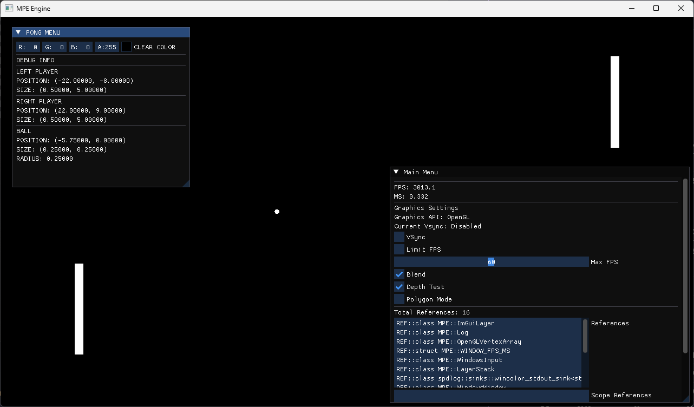

# Mere Primitive Engine

Small Game/Rendering Engine made in C++.

Why choose MPE? Because it's very primitive.

## Capabilities

### Platform

|     Windows     |      UNIX       |      macOS      | Raspberry PI 4 (RPI4) |
| :-------------: | :-------------: | :-------------: | :-------------------: |
|      __X__      |      __X__      |      __X__      |         __X__         |
| __64-bit only__ | __64-bit only__ | __64-bit only__ |   __32-bit/64-bit__   |

### Compiler

| Platform |  MSVC   |         GNU         |        CLANG        |
| :------: | :-----: | :-----------------: | :-----------------: |
| Windows  |  __X__  | Partially Supported | Partially Supported |
|   UNIX   | __N/A__ |        __X__        |        __X__        |
|  macOS   | __N/A__ |       __N/A__       |        __X__        |
|   RPI4   | __N/A__ |        __X__        |       __N/A__       |

### Graphics APIs

| Platform | OpenGL 4.6 | OpenGL 4.1 | OpenGL ES 3.1 | OpenGL ES 3.0 |
| :------: | :--------: | :--------: | :-----------: | :-----------: |
| Windows  |   __X__    |   __X__    |     __X__     |     __X__     |
|   UNIX   |   __X__    |   __X__    |     __X__     |     __X__     |
|  macOS   |  __N/A__   |   __X__    |    __N/A__    |     __X__     |
|   RPI4   |  __N/A__   |  __N/A__   |     __X__     |     __X__     |

## Hardware Support

Depending on the Graphics API used specific hardware requirements must be met:

* [OpenGL](https://www.opengl.org/)
* [OpenGLES](https://www.khronos.org/opengles/)

Of course OpenGL can be achieved without hardware acceleration but performance will be quite horrible.

#### Windows

* OpenGL 4.6 compatible GPU/iGPU 
* OpenGL ES 3.1 compatible GPU/iGPU
* OpenGL ES 3.0 compatible GPU/iGPU

#### UNIX

* OpenGL 4.6 compatible GPU/iGPU
* OpenGL ES 3.1 compatible GPU/iGPU
* OpenGL ES 3.0 compatible GPU/iGPU

#### macOS

* OpenGL 4.1 compatible GPU/iGPU
* OpenGL ES 3.0 compatible GPU/iGPU

#### RPI

* OpenGL ES 3.1 compatible GPU/iGPU
* OpenGL ES 3.0 compatible GPU/iGPU

## Working with Source and Requirements

* Working with source - [Windows](./Documentation/SETUP/WINDOWS.md)
* Working with source - [UNIX](./Documentation/SETUP/UNIX.md)
* Working with source - [OSX](./Documentation/SETUP/OSX.md)
* Working with source - [RPI4](./Documentation/SETUP/RPI4.md)

## Documentation

Current documentation generated with doxygen is minimal but available.

1. [MPE Core Engine](https://durengo.github.io/MPE/Documentation/MPE/html/index.html)

## Supported IDE

1. VScode integration
2. [WINDOWS ONLY] (In Progress) Visual Studio - if the project has been generated then you can run [.\Utility\Windows\open_vs.bat](/Utility/Windows/open_vs.bat) which will open the project in Visual Studio.
